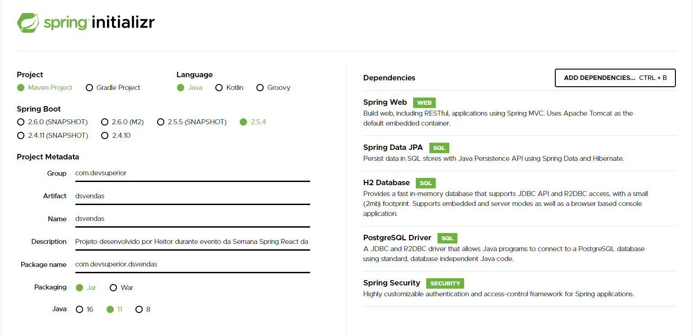

<a href="https://www.linkedin.com/in/heitor-machado-nascimento-4833801a2/">
 Linkedin - Heitor M Nascimento
</a>

# Dashboard de Vendas

## Para desenvolver o projeto, é necessário instalar as tecnologias:

#### JDK 11 - Zulu - https://www.azul.com/downloads/
Extrair na o arquivo baixado no caminho C:\Program Files\Java,
colocar esse mesmo caminho na variavel de ambiente JAVA_HOME e
colocar caminho C:\Program Files\Java\bin na varialvel de ambiente PATH, dessa maneira é possível alternar as versões do java apenas mudando a variavel de ambiente para a JDK que deseja utilizar.

#### STS Spring Tools - https://spring.io/tools
Será baixado o arquivo jar, ele pode ser aberto com qualquer programa de compactar arquivos, por isso é possível extrair os arquivos de dentro dele, após isso, tem um outro arquivo compactado dentro dele, abra e extraia a pasta STS no C: da máquina. Dentro dessa pasta há o arquivo executável com a IDE a ser utilizada.

#### POSTMAN - https://www.postman.com/downloads/

#### POSTGRE SQL - https://www.enterprisedb.com/downloads/postgres-postgresql-downloads
Executar e dar next em tudo, no lugar da senha definir a senha do seu banco de dados. Para testar, vá em Iniciar, digitar servicos e verificar se o postgre está em execução. Logo após testar o PGAdmin 4.

#### HEROKU CLI - https://devcenter.heroku.com/articles/heroku-cli
Dar next em tudo. Depois de instalar, testar no prompt o comando 'heroku -v'

#### NPM - https://nodejs.org/en/download/
Dar next em tudo e instalar tudo que aparecer na janela de prompt que surgir na tela, ele irá abrir o power shell e instalar todas as dependencias adicionais necessárias.

##### Yarn
Com o npm instalado, é possível instalar o yarn com o comando:
    
    npm install --global yarn
    yarn -v

## Preparação do projeto

O sistema trabalhará como monorepo, ou seja, terá apenas um repositório com o front e backend, com o formato: 

### Criando frontend com React

* Para criar o projeto ReactJS, utilize o comando:

        npx creat-react-app frontend --template typescript

    Com esse comando nós criamos o projeto com o nome frontend e utilizando um template de typescript que possui mais poder em relação ao javascript.

    Exclua a pasta oculta .git, pois devido o projeto completo ser monorepo, a pasta .git deve ficar na pasta que contem tanto o front como o backend, excluindo essa pasta nós conseguimos fazer com que o frontend não fique individualizado no git.

    Para testar o funcionamento basta utilizar o comando yarn start dentro da pasta frontend, isso irá abrir a aplicação em uma aba do navegador usando o localhost na porta 3000.

 ### Criando backend com Spring Initializer

 * Para criar o backend nós utilizaremos o site Spring initializer, com as seguintes dependencias: 

        Web
        JPA
        H2
        PostgreSQL
        Security
    
    Ele ficará da seguinte maneira:

    

    No final será gerado um arquivo zip que será descompactado dentro da pasta do projeto e renomeada para backend.
    
    Entre na IDE Spring Tools, abra a workspace do projeto, depois clique em:
    File>>Import...>Maven>>Existing maven project e escolha a pasta backend, aparecerá o arquivo pom.xml, depois clique em finish.

    Fazendo isso a IDE começará a baixar todas as dependencias que colocamos quando configuramos o Spring Initializer.

    Para testar o funcionamento, basta ir no canto inferior esquerdo, expandir a aba local e clicar com o botao direito no nome do projeto (no caso configuramos como "dsvendas") e após isso clicar em (Re)start, isso irá iniciar a aplicação na porta 8080.

### Limpando o projeto ReactJS

Vamos começar apagando alguns arquivos que vêm por padrão ao criarmos o projeto.

* Dentro da pasta public, vamos apagar todos os ícones e deixar apenas os arquivos:

        favicon.ico
        index.html

    Dentro do index podemos apagar todos os comentários e links, deixando apenas uma página HTML crua e mudar a lingua para pt_BR.

* Criar também um arquivo chamado "_redirects" que servirá para sempre que atualizarmos a página, recarregar a página index.html, o conteúdo desse arquivo é apenas essa linha:

        /* /index.html 200

* Dentro da pasta src podemos apagar todos os arquivos de estilo css, o arquivo App.test.tsx, o logo, o ReportWebVitals.ts e o SetupTests.ts. Deixando apenas os arquivos:

        App.tsx
        Index.tsx
        React-app-env-d.ts

    Não esquecendo de corrigir todos os imports e referencias aos arquivos que foram excluídos.

* No arquivo tsconfig.json, dentro de compilerOptions, adicionar a dependencia "baseUrl":"./src"

### Adicionando o bootstrap ao projeto

Para adicionar o bootstrap, vamos usar dentro da pasta frontend, o comando:

    yarn add bootstrap

Dentro do arquivo index.tsx, importar a referencia ao bootstrap com a linha:

    import 'bootstrap/dist/css/bootstrap.css';

### Informações a respeito do React

O React trabalha com componentes, por isso nós vamos separar nosso projeto de maneira com que tudo fique facil de visualizar. Para isso criamos a pasta assets, que terá a pasta com o arquivo de estilo css, a pasta com as imagens do projeto e a pasta com os componentes do React. Para cada componente, iremos criar uma pasta e um arquivo index.tsx que terá o código desse componente.

Cada componente é declarado como uma função que retorna um código HTML, essa função como em qualquer linguagem pode possuir atributos que podem ser usados dentro do código HTML que será retornado.

Dentro do arquivo App.tsx nós montamos a página utilizando cada componente que já foi montado previamente, tornando o código limpo e de fácil entendimento e manutenção.

### Deploy no netlify.

Para fazer o depoly na plataforma netlify, o projeto precisa estar no git, podendo estar no Github, Gitlab, ou Bitbucket, depois basta criarmos a conta no site, clicar em "New Site from Git", escolher a plataforma onde o código está hospedado, autenticar com sua conta e escolher o repositório.

Configurar os campos da seguinte maneira:

- Base directory: frontend
- Build command: yarn build
- Publish directory: frontend/build

Isso já servirá para fazer o deploy, depois disso o netlify criará um nome estranho para seu site, que para ser mudado basta ir em:

- Site settings -> Domain Management: (colocar o nome que você quiser)

Isso mudará o nome, mas aí voce terá que refazer o deploy para ele atualizar com um novo nome, para isso vá em: 

- Deploys -> Trigger deploy